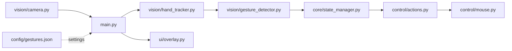

# Gesture-Controlled Laptop Interface

A local Windows desktop application that uses a normal webcam for touch-like hand-gesture control. All processing runs on the laptop: no backend, cloud service, database, API, voice feature, or automatic keyboard shortcut is included.

## Features

- Live webcam preview with MediaPipe hand landmarks.
- Index-finger cursor movement with a configurable control region and smoothing.
- Pinch-to-click with temporal confirmation, one click per pinch, and cooldown.
- Two-finger vertical scrolling.
- Fist dragging with a guaranteed button release when the gesture ends or the application exits.
- Local JSON configuration and an OpenCV debug overlay.
- Safe opt-in desktop control: preview is harmless unless the relevant flags are supplied.

## Architecture



```text
Cam-Gestures/
├── main.py                         # Application lifecycle and OpenCV preview loop
├── requirements.txt
├── config/
│   └── gestures.json               # Camera and gesture-control settings
├── vision/
│   ├── camera.py                   # Webcam ownership and frame reads
│   ├── hand_tracker.py             # MediaPipe hand landmarks
│   └── gesture_detector.py         # Rule-based semantic gestures
├── control/
│   ├── cursor.py                   # Coordinate mapping and smoothing
│   ├── mouse.py                    # PyAutoGUI mouse adapter
│   └── actions.py                  # Guarded click and scroll mappings
├── core/
│   ├── config.py                   # JSON loading and validation
│   ├── constants.py                # Application states
│   └── state_manager.py            # Debounce, drag, and cooldown transitions
├── ui/
│   └── overlay.py                  # Runtime diagnostic overlay
└── tests/                          # Non-hardware unit tests
```

## Requirements

- Windows 10 or 11
- Python 3.11 or 3.12
- A webcam

## Installation

```powershell
py -3.12 -m venv .venv
.\.venv\Scripts\Activate.ps1
python -m pip install --upgrade pip
python -m pip install -r requirements.txt
```

If PowerShell blocks activation, use `.\.venv\Scripts\python.exe` directly in the commands below.

## Run

Preview and diagnostics only:

```powershell
.\.venv\Scripts\python.exe main.py
```

Enable all implemented controls:

```powershell
.\.venv\Scripts\python.exe main.py --enable-cursor --enable-gesture-actions
```

Press `Esc` or `Q` in the preview to exit. The mouse button is released during all normal exit paths. PyAutoGUI's corner fail-safe also stops desktop actions.

## Gesture mappings

| Gesture | Action |
| --- | --- |
| Index finger | Move cursor (`--enable-cursor`) |
| Pinch | One left click after confirmation (`--enable-gesture-actions`) |
| Index + middle fingers | Vertical scrolling (`--enable-gesture-actions`) |
| Fist | Drag after confirmation (`--enable-gesture-actions`) |
| Open hand | Neutral; releases an active drag |

## Configuration

Edit [config/gestures.json](config/gestures.json) to set:

- Camera index and requested resolution
- Hand-detection confidence values
- Cursor smoothing and control region
- Pinch threshold, confirmation frames, and cooldown
- Scroll sensitivity and fist confirmation frames

Command-line options override individual settings. For example:

```powershell
.\.venv\Scripts\python.exe main.py --cursor-smoothing 0.8 --scroll-sensitivity 1.4
```

Use a different configuration file with `--config path\to\settings.json`.

## Debug overlay

The preview displays FPS, hand presence, gesture, application state, normalized fingertip coordinates, pinch ratio, cursor status, and the most recent action. This is useful when tuning values in `config/gestures.json`.

## Implementation status

| Phase | Status |
| --- | --- |
| 1. Webcam preview | Complete |
| 2. Hand landmarks | Complete |
| 3. Cursor movement | Complete |
| 4. Pinch click | Complete |
| 5. Two-finger scrolling | Complete |
| 6. Fist drag | Complete |
| 7. Explicit state manager | Complete |
| 8. JSON configuration | Complete |
| 9. Debug overlay | Complete |

## Troubleshooting

- **Camera cannot open:** close Teams, Zoom, or any other app using the camera. Try `--camera-index 1` for an external webcam.
- **`module 'mediapipe' has no attribute 'solutions'`:** use the project virtual environment and reinstall: `.\.venv\Scripts\python.exe -m pip install --force-reinstall -r requirements.txt`.
- **Preview is black:** enable desktop-app camera access in Windows Settings → Privacy & security → Camera.
- **Control is too sensitive:** increase `cursor.smoothing`, reduce `scroll_sensitivity`, or make the `cursor.control_region` smaller.

## Future roadmap

- PySide6 settings GUI, profiles, and alternative control modes.
- Improved/customizable gesture recognition.
- Optional voice activation in a later version.

Voice activation, cloud services, LLM integration, and destructive keyboard shortcuts are intentionally not implemented in this version.
