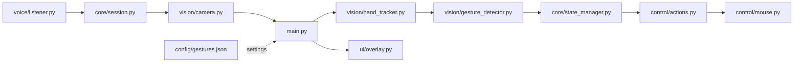

# Gesture-Controlled Laptop Interface

A local Windows desktop application that uses a normal webcam for touch-like hand-gesture control. All processing runs on the laptop: no backend, cloud service, database, or API is required.

The build plan for voice-activated, listen-first control is in [TASKS.md](TASKS.md).

## Features

- Live webcam preview with MediaPipe hand landmarks.
- Index-finger cursor movement with a configurable control region and smoothing.
- Pinch-to-click with temporal confirmation, one click per pinch, and cooldown.
- Two-finger vertical scrolling.
- Fist dragging with a guaranteed button release when the gesture ends or the application exits.
- Local JSON configuration and an OpenCV debug overlay.
- Safe opt-in desktop control: preview is harmless unless the relevant flags are supplied.
- Optional listen-first voice activation: camera stays off until a wake phrase or Space.

## Architecture



```text
Cam-Gestures/
├── main.py                         # Session loop: listening vs active camera
├── TASKS.md                        # Build plan for voice-activated control
├── requirements.txt
├── models/
│   └── hand_landmarker.task        # MediaPipe HandLandmarker model bundle
├── config/
│   └── gestures.json               # Camera, gesture, and voice settings
├── vision/
│   ├── camera.py                   # Webcam ownership and frame reads
│   ├── hand_tracker.py             # MediaPipe hand landmarks
│   └── gesture_detector.py         # Rule-based semantic gestures
├── control/
│   ├── cursor.py                   # Coordinate mapping and smoothing
│   ├── mouse.py                    # PyAutoGUI mouse adapter
│   └── actions.py                  # Guarded click and scroll mappings
├── core/
│   ├── config.py                   # JSON loading and validation
│   ├── constants.py                # Gesture and session states
│   ├── session.py                  # Idle/active camera lifecycle
│   └── state_manager.py            # Debounce, drag, and cooldown transitions
├── voice/
│   ├── commands.py                 # Wake/stop/quit phrase matching
│   └── listener.py                 # Offline Vosk microphone thread
├── ui/
│   └── overlay.py                  # Runtime diagnostic overlay
└── tests/                          # Non-hardware unit tests
```

## Requirements

- Windows 10 or 11
- Python 3.11 or 3.12
- A webcam

## Installation

```powershell
py -3.12 -m venv .venv
.\.venv\Scripts\Activate.ps1
python -m pip install --upgrade pip
python -m pip install -r requirements.txt
```

Download the hand landmarker model into `models/`:

```powershell
New-Item -ItemType Directory -Force -Path models
Invoke-WebRequest `
  -Uri "https://storage.googleapis.com/mediapipe-models/hand_landmarker/hand_landmarker/float16/1/hand_landmarker.task" `
  -OutFile "models\hand_landmarker.task"
```

If PowerShell blocks activation, use `.\.venv\Scripts\python.exe` directly in the commands below.

## Run

Preview and diagnostics only:

```powershell
.\.venv\Scripts\python.exe main.py
```

Enable all implemented controls:

```powershell
.\.venv\Scripts\python.exe main.py --hands-free
```

Listen first (camera off until you say **activate** or press Space):

```powershell
.\.venv\Scripts\python.exe main.py --enable-voice --hands-free
```

Voice uses an offline Vosk model. Download a small English model and unpack it to `models/vosk-model-small-en-us` (the folder that contains `am/` and `conf/`):

```powershell
New-Item -ItemType Directory -Force -Path models
Invoke-WebRequest `
  -Uri "https://alphacephei.com/vosk/models/vosk-model-small-en-us-0.15.zip" `
  -OutFile "models\vosk-model-small-en-us.zip"
Expand-Archive models\vosk-model-small-en-us.zip -DestinationPath models
Rename-Item models\vosk-model-small-en-us-0.15 models\vosk-model-small-en-us
```

Allow microphone access in Windows Settings → Privacy & security → Microphone.

Press `Esc` to pause (voice mode) or quit (preview mode). Press `Q` to exit. The mouse button is released during all normal exit paths. PyAutoGUI's corner fail-safe also stops desktop actions.

## Gesture mappings

| Gesture | Action |
| --- | --- |
| Index finger | Move cursor (`--enable-cursor`) |
| Pinch | One left click after confirmation (`--enable-gesture-actions`) |
| Index + middle fingers | Vertical scrolling (`--enable-gesture-actions`) |
| Fist | Drag after confirmation (`--enable-gesture-actions`) |
| Open hand | Neutral; releases an active drag |

## Configuration

Edit [config/gestures.json](config/gestures.json) to set:

- Camera index and requested resolution
- Hand-detection confidence values
- Cursor smoothing and control region
- Pinch threshold, confirmation frames, and cooldown
- Scroll sensitivity and fist confirmation frames
- Voice enable flag, wake/stop/quit phrases, and Vosk model path

Command-line options override individual settings. For example:

```powershell
.\.venv\Scripts\python.exe main.py --cursor-smoothing 0.8 --scroll-sensitivity 1.4
```

Use a different configuration file with `--config path\to\settings.json`.

## Debug overlay

The preview displays FPS, hand presence, gesture, application state, normalized fingertip coordinates, pinch ratio, cursor status, and the most recent action. This is useful when tuning values in `config/gestures.json`.

## Implementation status

| Phase | Status |
| --- | --- |
| 1. Webcam preview | Complete |
| 2. Hand landmarks | Complete |
| 3. Cursor movement | Complete |
| 4. Pinch click | Complete |
| 5. Two-finger scrolling | Complete |
| 6. Fist drag | Complete |
| 7. Explicit state manager | Complete |
| 8. JSON configuration | Complete |
| 9. Debug overlay | Complete |
| 10. Idle/active sessions | Complete |
| 11. Voice wake/stop | Complete (needs Vosk model download) |

## Troubleshooting

- **Camera cannot open:** close Teams, Zoom, or any other app using the camera. Try `--camera-index 1` for an external webcam.
- **`Hand landmarker model not found`:** download `hand_landmarker.task` into `models/` (see Installation).
- **Preview is black:** enable desktop-app camera access in Windows Settings → Privacy & security → Camera.
- **Control is too sensitive:** increase `cursor.smoothing`, reduce `scroll_sensitivity`, or make the `cursor.control_region` smaller.
- **Voice does not start:** install `vosk` and `sounddevice`, allow microphone access, and confirm `models/vosk-model-small-en-us` exists. Space still starts the camera if the listener is running.

## Roadmap

Tracked in [TASKS.md](TASKS.md):

- Idle/active sessions so the camera stays off until you activate control
- Offline voice wake/stop phrases
- VS Code launch configs and a later settings GUI

Cloud services, LLM integration, and destructive keyboard shortcuts stay out of scope.
