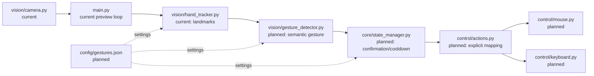

<<<<<<< HEAD
# Gesture-Controlled Laptop Interface

A local Windows desktop application that uses a normal webcam to make gesture-based control feel like a touchscreen. All processing runs on the laptop: there is no backend, cloud service, database, API, voice feature, or automatic keyboard shortcut.

**Current implementation:** Phases 1–5 are complete. Cursor movement, pinch clicking, and two-finger scrolling are available only when explicitly enabled. Dragging and keyboard actions are not implemented.

## Current features

- Opens a selected webcam and displays its live frames.
- Detects up to one hand and draws its 21 MediaPipe landmarks and connections.
- Exposes normalized landmark coordinates through a dedicated tracking module, ready for later gesture detection.
- Handles unavailable cameras and failed frame reads with a clear message.
- Releases the camera and closes OpenCV windows on exit.
- Uses `Esc` or `Q` to quit the preview.
- Supports opt-in index-finger cursor movement with a visible control region and configurable exponential smoothing.
- Supports opt-in pinch-to-click after temporal confirmation, with a cooldown and one click per pinch.
- Supports opt-in two-finger vertical scrolling with bounded sensitivity.

## Target architecture

```text
Cam-Gestures/
├── main.py                         # Application lifecycle and OpenCV preview loop
├── requirements.txt                # Pinned Python dependencies
├── README.md
├── .gitignore
├── config/
│   └── gestures.json               # Later: thresholds, smoothing, camera preferences
├── vision/
│   ├── __init__.py
│   ├── camera.py                   # Webcam ownership, frame reads, error handling
│   ├── hand_tracker.py             # MediaPipe hand detection and normalized landmarks
│   └── gesture_detector.py         # Later: landmarks -> semantic gestures
├── control/
│   ├── __init__.py
│   ├── mouse.py                    # PyAutoGUI mouse adapter
│   ├── cursor.py                   # Cursor mapping and smoothing
│   ├── keyboard.py                 # Later: isolated keyboard adapter
│   └── actions.py                  # Gesture event -> explicit allowed mouse action
├── core/
│   ├── __init__.py
│   ├── constants.py                # Later: shared enums/constants
│   └── state_manager.py            # Later: debounce/cooldown state machine
├── ui/
│   ├── __init__.py
│   └── overlay.py                  # Later: debug overlay, followed by a PySide6 UI
└── tests/
    └── test_hand_tracker.py        # Non-hardware regression tests
```

Only the files marked as current below exist today; the rest are deliberate extension points rather than implemented features.



## Current repository layout

```text
Cam-Gestures/
├── main.py                 # Preview application loop
├── requirements.txt
├── vision/
│   ├── __init__.py
│   ├── camera.py           # Webcam ownership only
│   └── hand_tracker.py     # MediaPipe hand landmarks only
├── control/                # Reserved for later desktop actions
│   ├── cursor.py            # Cursor mapping and smoothing
│   └── mouse.py             # PyAutoGUI mouse adapter
├── core/                   # Reserved for state management
├── ui/                     # Reserved for overlays/UI
└── tests/                  # Non-hardware regression tests
```

## Requirements

- Windows 10 or 11
- Python 3.11 or 3.12 (developed with Python 3.12)
- A functioning webcam

## Installation

From PowerShell in the repository root:

```powershell
py -3.12 -m venv .venv
.\.venv\Scripts\Activate.ps1
python -m pip install --upgrade pip
python -m pip install -r requirements.txt
```

If PowerShell blocks the activation script, run the commands using `.venv\Scripts\python.exe` instead.

## Run

```powershell
.\.venv\Scripts\python.exe main.py
```

Use a different camera or requested resolution when needed:

```powershell
.\.venv\Scripts\python.exe main.py --camera-index 1 --width 1280 --height 720
```

To turn on cursor movement, use the explicit opt-in flag. It moves the cursor only; it never clicks or presses keys.

```powershell
.\.venv\Scripts\python.exe main.py --enable-cursor
```

To enable Phase 4 and 5 actions as well, add the action opt-in flag. Keep the preview window focused so `Esc` can stop the application immediately.

```powershell
.\.venv\Scripts\python.exe main.py --enable-cursor --enable-gesture-actions
```

Press `Esc` or `Q` in the preview window to close it. Closing the preview window also stops the program.

## Implementation status

| Phase | Scope | Status |
| --- | --- | --- |
| 1 | Webcam capture, preview, safe release, `Esc`/`Q` exit | Complete |
| 2 | MediaPipe hand detection, normalized landmarks, landmark drawing | Complete |
| 3 | Index-finger cursor mapping, control region, smoothing | Complete; enabled only with `--enable-cursor` |
| 4 | Pinch-to-click with transition detection and cooldown | Complete; enabled only with `--enable-gesture-actions` |
| 5 | Two-finger scrolling | Complete; enabled only with `--enable-gesture-actions` |
| 6 | Fist drag with guaranteed mouse release | Not started |
| 7 | `IDLE`, `ACTIVE`, `DRAGGING`, `SCROLLING`, `COOLDOWN` state manager | Not started |
| 8 | JSON configuration system | Not started |
| 9 | FPS/gesture/state debug overlay | Not started |
| Future | PySide6 settings UI, profiles, alternative modes, voice activation | Deliberately not started |

## Troubleshooting

- **Unable to open camera:** close apps such as Teams, Zoom, or another camera preview that may be using it. Try `--camera-index 1` for an external webcam.
- **No `py -3.12` command:** install Python 3.11 or 3.12 from python.org, then create the virtual environment with that installed version.
- **Preview is black:** check Windows Settings → Privacy & security → Camera and allow desktop apps to access the camera.
- **`module 'mediapipe' has no attribute 'solutions'`:** do not run a global `python main.py`. From the repository root, run `.\.venv\Scripts\python.exe -m pip install --force-reinstall -r requirements.txt`, then use `.\.venv\Scripts\python.exe main.py`. This project pins MediaPipe 0.10.14 because later releases removed the hand-tracking API used here.

## Roadmap

The next implementation phase is fist dragging with guaranteed mouse-button release on every exit path. Voice activation, cloud services, and automatic keyboard shortcuts remain intentionally out of scope.
=======
# Cam-Gestures
Gestures contorlled webcam for control
>>>>>>> 66ac9d8ef95acc154e6d221d2c1fb17d284cc579
